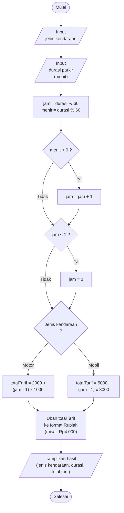

# Perhitungan Tarif Parkir 🚗🏍️

**Anggota Kelompok:**
1. Fadhil Hidayattulloh
2. Agit Elhandinnata

---

## 📖 Tentang Program
Program ini digunakan untuk menghitung total tarif parkir kendaraan berdasarkan jenis kendaraan (Motor atau Mobil) dan durasi waktu parkir (dalam satuan menit). Program ini dibuat murni menggunakan fungsi, operator pembagian bulat (`~/`), modulus (`%`), dan struktur `switch` tanpa menggunakan *Map* atau *Class*.

## 📋 Business Rule (Aturan Bisnis)
Berikut adalah aturan bisnis yang digunakan sebagai acuan logika perhitungan dalam program ini:

| Kode | Business Rule |
| :---: | :--- |
| **BR-01** | Durasi parkir dihitung per jam, sisa menit dibulatkan ke atas (minimal 1 jam). |
| **BR-02** | Motor: Rp2.000 jam pertama, Rp1.000 untuk setiap jam berikutnya. |
| **BR-03** | Mobil: Rp5.000 jam pertama, Rp3.000 untuk setiap jam berikutnya. |

## ⚙️ Input dan Output
* **Input:**
  * `kendaraan` → untuk menentukan jenis kendaraan menggunakan `enum` (Motor atau Mobil).
  * `totalMenit` → durasi lama parkir dalam satuan menit (tipe data *integer*).
* **Output:** 
  Total tarif yang harus dibayar oleh pelanggan (berupa angka bulat / *integer* yang ditampilkan dengan teks "Rp").

---

## 🛤️ Alur Program (Flowchart)
*Catatan: GitHub akan otomatis membaca kode di bawah ini dan merendernya menjadi gambar diagram.*



---

## 💻 Source Code
```dart
enum JenisKendaraan { motor, mobil }

int hitungJamParkir(int totalMenit) {
  int jam = totalMenit ~/ 60; 
  final int sisaMenit = totalMenit % 60; // pake final karena nilai sisa waktu ga akan diubah lagi
  
  // jika ada sisa menit di bulatkan keatas
  if (sisaMenit > 0) { 
    jam = jam + 1;
  }

  // rule minimal parkir itu 1 jam
  if (jam < 1) {
    jam = 1;
  }

  return jam;
}

int hitungTarifParkir(JenisKendaraan kendaraan, int totalMenit) {
  final int totalJam = hitungJamParkir(totalMenit);
  int totalTarif = 0;

  switch (kendaraan) {
    case JenisKendaraan.motor:
      totalTarif = 2000 + ((totalJam - 1) * 1000);
      break;

    case JenisKendaraan.mobil:
      totalTarif = 5000 + ((totalJam - 1) * 3000);
      break;
  }

  return totalTarif;
}

void main() {
  print('Motor, 30 menit   : Rp${hitungTarifParkir(JenisKendaraan.motor, 30)}');
  print('Motor, 150 menit  : Rp${hitungTarifParkir(JenisKendaraan.motor, 150)}');
  print('Mobil, 60 menit   : Rp${hitungTarifParkir(JenisKendaraan.mobil, 60)}');
  print('Mobil, 181 menit  : Rp${hitungTarifParkir(JenisKendaraan.mobil, 181)}');
}
```

---

## ✅ Hasil Pengujian
Pengujian dilakukan berdasarkan skenario untuk memastikan logika durasi (pembulatan ke atas) dan pemilihan tarif (berdasarkan jenis kendaraan) berjalan sesuai Aturan Bisnis.

| Skenario | Kendaraan | Durasi (Input) | Total Jam (Dibulatkan) | Expected Tarif (Output) | Status |
| :---: | :--- | :--- | :---: | :--- | :---: |
| 1 | Motor | 30 menit | 1 Jam | Rp2.000 | Sukses |
| 2 | Motor | 150 menit | 3 Jam | Rp4.000 | Sukses |
| 3 | Mobil | 60 menit | 1 Jam | Rp5.000 | Sukses |
| 4 | Mobil | 181 menit | 4 Jam* | Rp14.000 | Sukses |

*\* Pada skenario 4 (181 menit), 180 menit adalah 3 jam, dan sisa 1 menit dibulatkan ke atas sehingga total dihitung menjadi 4 jam parkir.*

---

## 📌 Kesimpulan
Program ini berhasil mengimplementasikan *Business Rule* perhitungan tarif parkir menggunakan fitur dasar Dart:
1. Menggunakan **`enum`** untuk membatasi opsi `JenisKendaraan`, mencegah kesalahan pengetikan *(typo)*.
2. Menggunakan **operator pembagian bulat (`~/`)** dan **modulus (`%`)** untuk mengonversi durasi menit menjadi jam serta mendeteksi sisa waktu untuk aturan pembulatan ke atas.
3. Rumus `(totalJam - 1)` digunakan dengan tepat agar tarif jam pertama tidak ikut dikalikan dengan tarif jam berikutnya, menghindari *double charge* pada perhitungan total bayar.
